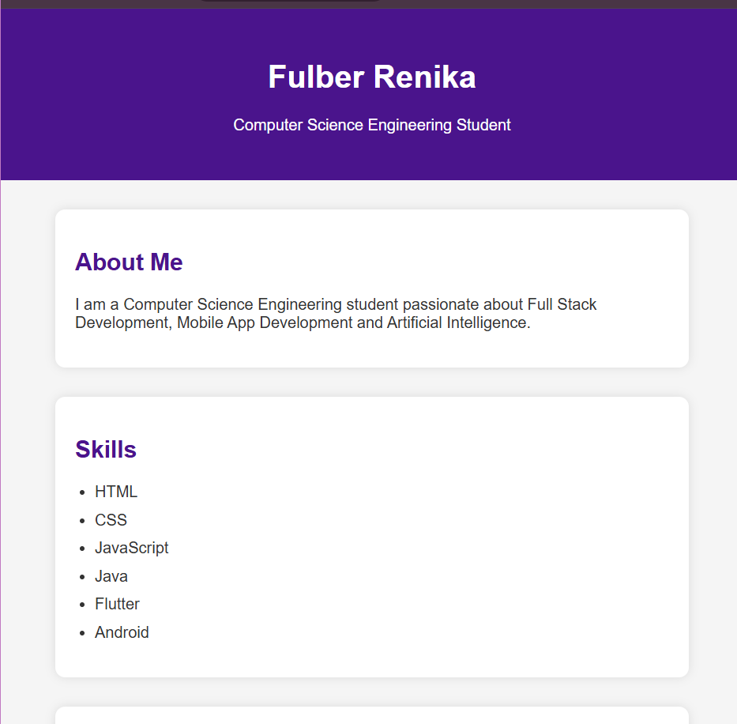

# 💼 Personal Portfolio Website

A responsive Personal Portfolio Website developed using **HTML**, **CSS**, and **JavaScript** as part of the **CodTech Internship - Task 3**.

## 📌 Project Overview

This project is a simple and responsive personal portfolio website that showcases my profile, skills, projects, and contact information. It is designed with a clean user interface and serves as an online portfolio to highlight my work and technical skills.

## ✨ Features

- Responsive Web Design
- Clean and Modern User Interface
- About Me Section
- Skills Section
- Projects Section
- Contact Information
- Smooth Navigation

## 🛠️ Technologies Used

- HTML5
- CSS3
- JavaScript
- Visual Studio Code

## 📱 Screenshots



## 🚀 How to Run

1. Clone the repository

```
git clone https://github.com/FulberRenika/Task-3-Personal-Portfolio.git
```

2. Open the project folder.

3. Open `index.html` in any modern web browser.

---

## 👩‍💻 Author

Fulber Renika

Intern ID: CITS3812

Computer Science Engineering Student

CodTech Internship - Web Development Task 3

---
